# Procesverslag
Markdown is een simpele manier om HTML te schrijven.  
Markdown cheat cheet: [Hulp bij het schrijven van Markdown](https://github.com/adam-p/markdown-here/wiki/Markdown-Cheatsheet).

Nb. De standaardstructuur en de spartaanse opmaak van de README.md zijn helemaal prima. Het gaat om de inhoud van je procesverslag. Besteedt de tijd voor pracht en praal aan je website.

Nb. Door *open* toe te voegen aan een *details* element kun je deze standaard open zetten. Fijn om dat steeds voor de relevante stuk(ken) te doen.

## Jij

  
uitwerken voor kick-off werkgroep

  ### Auteur:
  Stephan Sierra Perdomo

  #### Je startniveau:
  Rood

  #### Je focus:
  Responsive
 

## Je website

  
uitwerken voor kick-off werkgroep

  ### Je opdracht:
  minecraft.net
  minecraft.net/community

  #### Screenshot(s) van de eerste pagina (small screen): 
  Minecraft homepage  
  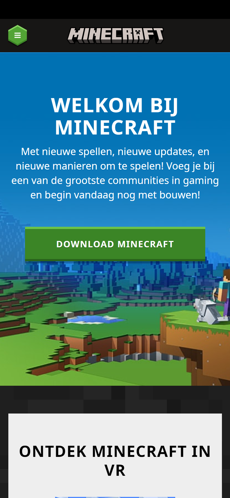
  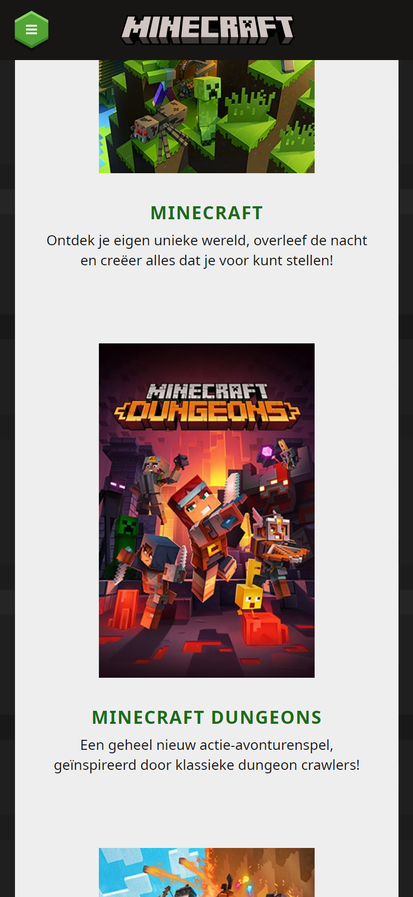
  

  #### Screenshot(s) van de tweede pagina (small screen):
  Minecraft community page
  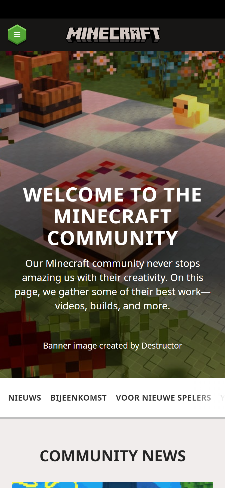
  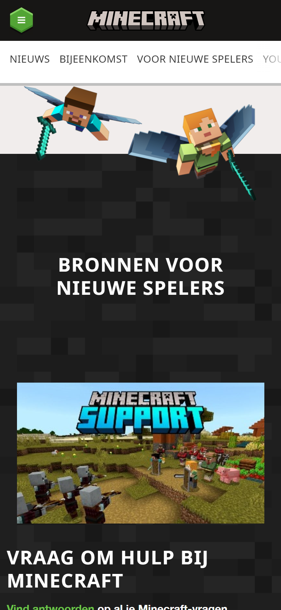
  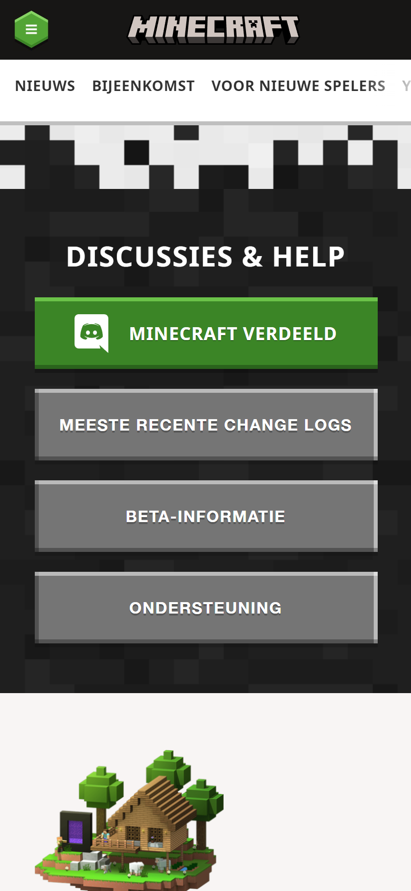
 

## Toegankelijkheidstest 1/2 (week 1)

  
uitwerken na test in 1e werkgroep

  ### Bevindingen
  Lijst met je bevindingen die in de test naar voren kwamen:

  #### Screenreader
  De screenreader las in principe alles op. Wat aan de ene kant fijn kan zijn, maar bij een collectie van artikelen las hij ook echt alles op. Bij dit soort content zou ik alleen de titel willen weten en niet de beschrijving. Hierdoor duurt het dus heel lang voordat je naar de volgende items gaat. Af en toe leest de screenreader ook dingen die onzichtbaar zijn op het scherm.

  Oplossingen:
  De screenreader alleen de belangrijke dingen laten lezen. Dingen als headings, navigatie en bepaalde links. Achtergrond afbeeldingen die bedoelt zijn voor mooiheid hoeven niet voorgelezen te worden.

  #### Muis en Toetsenbord 
  Het tabben ging over het algemeen redelijk goed, behalve bij afbeeldingen met een horizontale scroll. Dan scrollt hij soms wel mee, maar soms wilt hij niet de laatste afbeelding selecteren. Wanneer je terug wil gaan met shift selecteert hij alleen de pijlen en de middelste afbeelding in plaats van alle afbeeldingen. Heel verwarrend gedrag dus.

  Oplossingen:
  Bij het horizontale scroll gedeelte alleen de pijlen en het middelste artikelen laten selecteren. Zo kan je sneller door de site en nogsteeds door de artikelen heen. Verder zou ik de focus bij sommige objecten iets duidelijker maken (dikkere omlijning, meer contrast).

  #### Motoriek (shocks, elastiekjes)
  Met de shocks is het lastig om je telefoon in het algemeen vast te houden. Ook ga je snel perongeluk op dingen drukken waar je niet op wil drukken. Wat ik ook merkte was dat wanneer je je rechterhand gebruikt is het enorm lastig om op knoppen te drukken die linksbovenin zijn. Typen is ook erg lastig.

  Oplossingen:
  Ik zou grotere knoppen maken, minder content per scherm/pagina, meer knoppen in het midden ipv helemaal links of rechts, voice besturing om dingen te typen

  #### Visueel (brillen, contrast, kleurenblind, dark/light). 
  Met de wazige bril merkte ik vooral dat ik niet goed dunne tekst op een witte achtergrond kon lezen. Bij sommige donkere afbeeldingen kon ik ook voor een groot gedeelte niet zien wat het moest voorstellen.

  Oplossingen:
  Grotere tekst, minder tekst voor een witte achtergrond, echt zwarte tekst (niet grijs).

## Breakdownschets (week 1)

  
uitwerken na afloop 2e werkgroep

  ### de hele pagina: 
  

  ### dynamisch deel (bijv menu): 
  

  ### wellicht nog een dynamisch deel (bijv filter): 
  

## Voortgang 1 (week 2)

  
uitwerken voor 1e voortgang

  ### Stand van zaken
  Html schrijven ging goed. CSS gaat ook wel goed, maar het is toch weer even uitvinden hoe het allemaal werkt. Het is ook best frustrerend voor mij, want ik weet wat ik wil maken, maar ik doe er heel lang over om simpele dingen te doen. Momenteel heb ik een deel van de eerste pagina af (4 van de 5 sections), maar er valt nog wel wat werk te doen.

  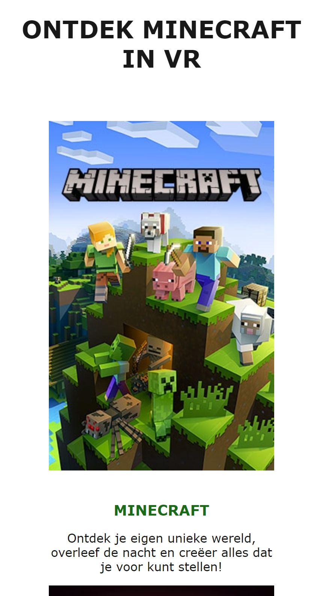
  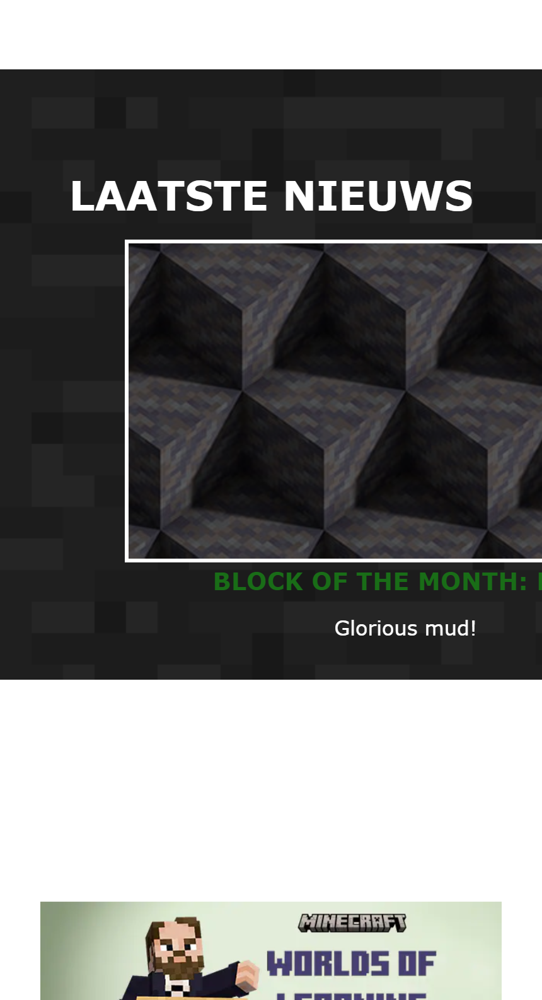
  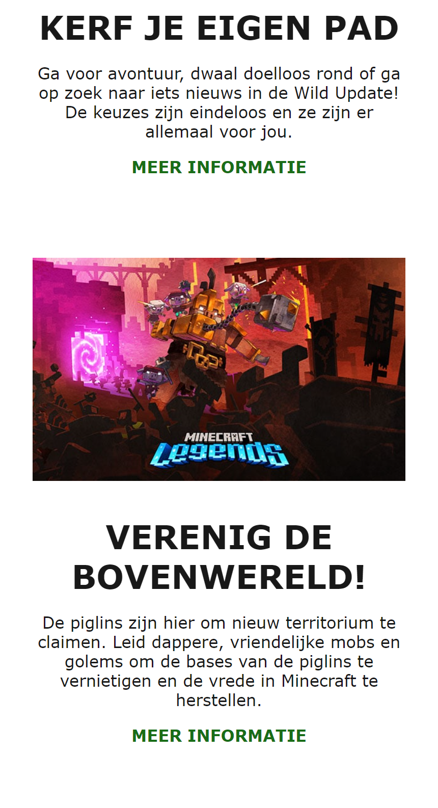

  ### Agenda voor meeting
  samen met je groepje opstellen

    stephan:
    - flex wrap: het doet niet wat ik wil, hoe krijg ik er meer controle over?
    - wat is een goede manier om afbeeldingen responsive te maken?
    - wanneer ik een maximale breedte geef aan elementen, dan staat het niet meer in het midden. Hoe los ik dat op? 

  <!-- | student 1      | student 2          | student 3    | student 4        |
  | ---            | ---                | ---          | ---              |
  | dit bespreken  | en dit             | en ik dit    | en dan ik dat    |
  | en dat ook nog | dit als er tijd is | nog een punt | dit wil ik zeker |
  | ...            | ...                | ...          | ...              | -->

  ### Verslag van meeting
  hier na afloop snel de uitkomsten van de meeting vastleggen

  - punt 1
  - punt 2
  - nog een punt
  - ...

## Voortgang 2 (week 3)

  
uitwerken voor 2e voortgang

  ### Stand van zaken
  Het gaat wat mij betreft heel goed, maar tegelijkertijd is er ook veel dat ik nog wil doen. Mijn eerste pagina is zo goed als af. Ik wil aan het begin van week 4 mijn tweede pagina af hebben. De rest van week 4 wil ik alleen nog de puntjes op de i zetten en extra leuke dingen toevoegen (animaties, betere vormgeving etc.).
  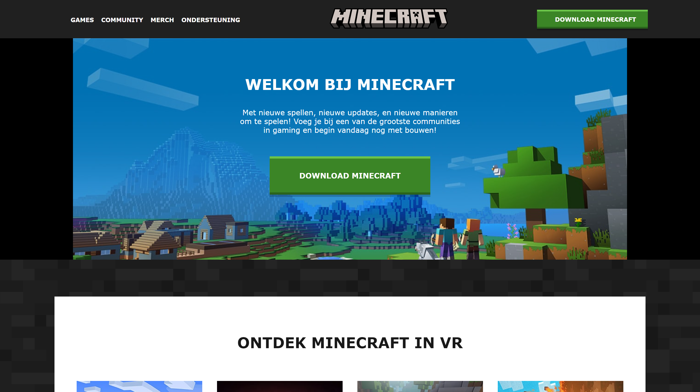
  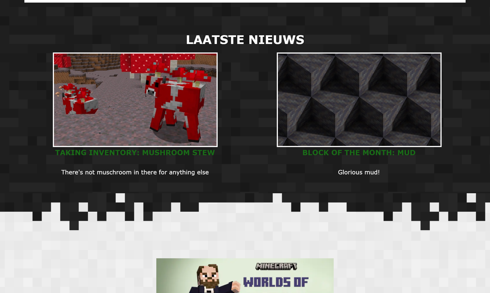
  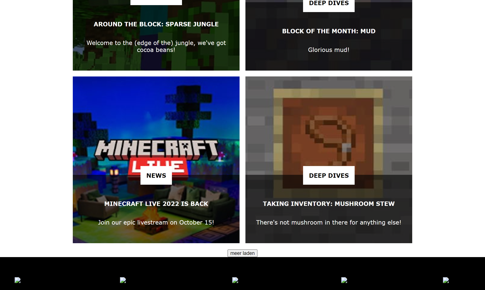
  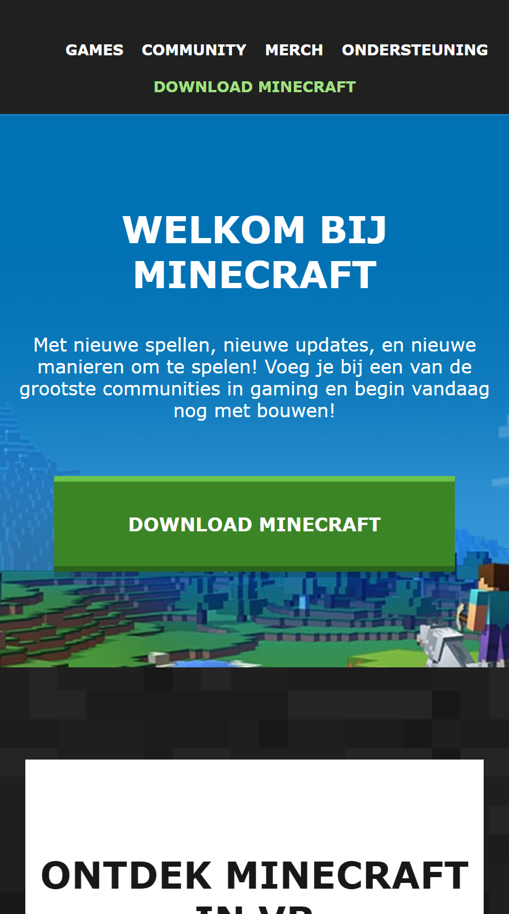
  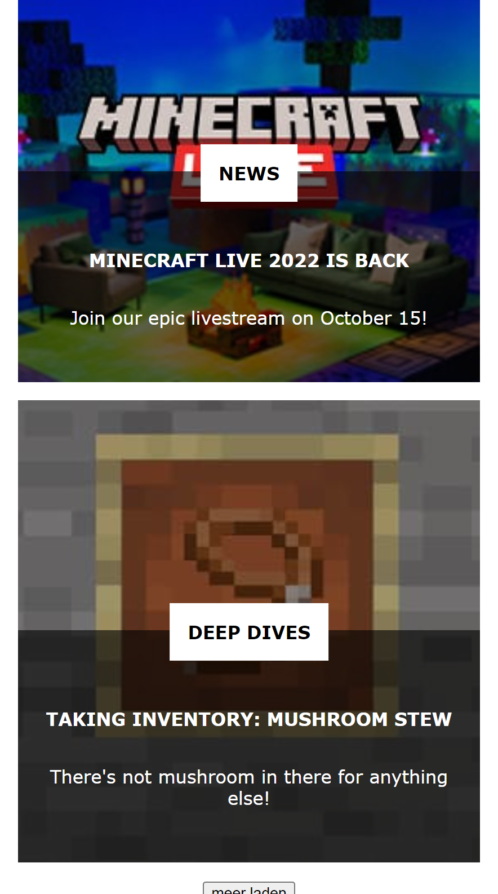

  ### Agenda voor meeting
  samen met je groepje opstellen

    Stephan:
    -Ik wil het graag hebben over toegankelijkheid en hoe ik dat het beste kan toepassen op mijn website. Dingen als skip to content en arialabels wil ik wel meer van weten.

  <!-- | student 1      | student 2          | student 3    | student 4        |
  | ---            | ---                | ---          | ---              |
  | Flex wrap, img      | en dit             | en ik dit    | en dan ik dat    |
  | en dat ook nog | dit als er tijd is | nog een punt | dit wil ik zeker |
  | ...            | ...                | ...          | ...              | -->

  ### Verslag van meeting
  hier na afloop snel de uitkomsten van de meeting vastleggen

  - punt 1
  - punt 2
  - nog een punt
- ...

## Toegankelijkheidstest 2/2 (week 4)

  
uitwerken na test in 8e werkgroep

  ### Bevindingen
  Lijst met je bevindingen die in de test naar voren kwamen (geef ook aan wat er verbeterd is):

  #### Screenreader
  Hier korte omschrijving (met indien nodig afbeeldingen)

  Hier een omschrijving van hoe het opgelost kan worden (met indien nodig afbeeldingen)

  #### Muis en Toetsenbord 
  Hier korte omschrijving (met indien nodig afbeeldingen)

  Hier een omschrijving van hoe het opgelost kan worden (met indien nodig afbeeldingen)

  #### Motoriek (shocks, elastiekjes)
  Hier korte omschrijving (met indien nodig afbeeldingen)

  Hier een omschrijving van hoe het opgelost kan worden (met indien nodig afbeeldingen)

  #### Visueel (brillen, contrast, kleurenblind, dark/light). 
  Hier korte omschrijving (met indien nodig afbeeldingen)

  Hier een omschrijving van hoe het opgelost kan worden (met indien nodig afbeeldingen)

## Voortgang 3 (week 4)

  
uitwerken voor 3e voortgang

  ### Stand van zaken
  hier dit ging goed & dit was lastig (neem ook screenshots op van delen van je website en code)

  ### Agenda voor meeting
  samen met je groepje opstellen

  | student 1      | student 2          | student 3    | student 4        |
  | ---            | ---                | ---          | ---              |
  | dit bespreken  | en dit             | en ik dit    | en dan ik dat    |
  | en dat ook nog | dit als er tijd is | nog een punt | dit wil ik zeker |
  | ...            | ...                | ...          | ...              |

  ### Verslag van meeting
  hier na afloop snel de uitkomsten van de meeting vastleggen

  - punt 1
  - punt 2
  - nog een punt
  - ...

## Eindgesprek (week 5)

  
uitwerken voor eindgesprek

  ### Je uitkomst - karakteristiek screenshots:
  

  ### Dit ging goed/Heb ik geleerd: 
  Korte omschrijving met plaatjes

  

  ### Dit was lastig/Is niet gelukt:
  Korte omschrijving met plaatjes

  

## Bronnenlijst

  
continu bijhouden terwijl je werkt

  Nb. Wees specifiek ('css-tricks' als bron is bijv. niet specifiek genoeg).

  1. bron 1
  2. bron 2
  3. ...

