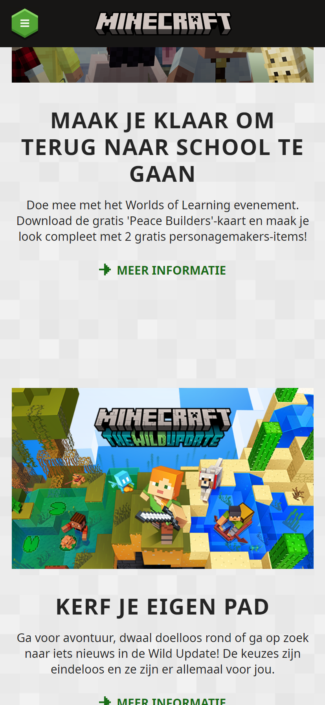

# Procesverslag
Markdown is een simpele manier om HTML te schrijven.  
Markdown cheat cheet: [Hulp bij het schrijven van Markdown](https://github.com/adam-p/markdown-here/wiki/Markdown-Cheatsheet).

Nb. De standaardstructuur en de spartaanse opmaak van de README.md zijn helemaal prima. Het gaat om de inhoud van je procesverslag. Besteedt de tijd voor pracht en praal aan je website.

Nb. Door *open* toe te voegen aan een *details* element kun je deze standaard open zetten. Fijn om dat steeds voor de relevante stuk(ken) te doen.

## Jij

  
uitwerken voor kick-off werkgroep

  ### Auteur:
  Stephan Sierra Perdomo

  #### Je startniveau:
  Rood

  #### Je focus:
  Responsive
 

## Je website

  
uitwerken voor kick-off werkgroep

  ### Je opdracht:
  minecraft.net
  minecraft.net/community

  #### Screenshot(s) van de eerste pagina (small screen): 
  Minecraft homepage  
  
  
  

  #### Screenshot(s) van de tweede pagina (small screen):
  Minecraft legends pagina
  
  
  
 

## Toegankelijkheidstest 1/2 (week 1)

  
uitwerken na test in 1e werkgroep

  ### Bevindingen
  Lijst met je bevindingen die in de test naar voren kwamen:

  #### Screenreader
  De screenreader las in principe alles op. Wat aan de ene kant fijn kan zijn, maar bij een collectie van artikelen las hij ook echt alles op. Bij dit soort content zou ik alleen de titel willen weten en niet de beschrijving. Hierdoor duurt het dus heel lang voordat je naar de volgende items gaat. Af en toe leest de screenreader ook dingen die onzichtbaar zijn op het scherm.

  Oplossingen:
  De screenreader alleen de belangrijke dingen laten lezen. Dingen als headings, navigatie en bepaalde links. Achtergrond afbeeldingen die bedoelt zijn voor mooiheid hoeven niet voorgelezen te worden.

  #### Muis en Toetsenbord 
  Het tabben ging over het algemeen redelijk goed, behalve bij afbeeldingen met een horizontale scroll. Dan scrollt hij soms wel mee, maar soms wilt hij niet de laatste afbeelding selecteren. Wanneer je terug wil gaan met shift selecteert hij alleen de pijlen en de middelste afbeelding in plaats van alle afbeeldingen. Heel verwarrend gedrag dus.

  Oplossingen:
  Bij het horizontale scroll gedeelte alleen de pijlen en het middelste artikelen laten selecteren. Zo kan je sneller door de site en nogsteeds door de artikelen heen. Verder zou ik de focus bij sommige objecten iets duidelijker maken (dikkere omlijning, meer contrast).

  #### Motoriek (shocks, elastiekjes)
  Met de shocks is het lastig om je telefoon in het algemeen vast te houden. Ook ga je snel perongeluk op dingen drukken waar je niet op wil drukken. Wat ik ook merkte was dat wanneer je je rechterhand gebruikt is het enorm lastig om op knoppen te drukken die linksbovenin zijn. Typen is ook erg lastig.

  Oplossingen:
  Ik zou grotere knoppen maken, minder content per scherm/pagina, meer knoppen in het midden ipv helemaal links of rechts, voice besturing om dingen te typen

  #### Visueel (brillen, contrast, kleurenblind, dark/light). 
  Met de wazige bril merkte ik vooral dat ik niet goed dunne tekst op een witte achtergrond kon lezen. Bij sommige donkere afbeeldingen kon ik ook voor een groot gedeelte niet zien wat het moest voorstellen.

  Oplossingen:
  Grotere tekst, minder tekst voor een witte achtergrond, echt zwarte tekst (niet grijs).

## Breakdownschets (week 1)

  
uitwerken na afloop 2e werkgroep

  ### de hele pagina: 
  

## Voortgang 1 (week 2)

  
uitwerken voor 1e voortgang

  ### Stand van zaken
  Html schrijven ging goed. CSS gaat ook wel goed, maar het is toch weer even uitvinden hoe het allemaal werkt. Het is ook best frustrerend voor mij, want ik weet wat ik wil maken, maar ik doe er heel lang over om simpele dingen te doen. Momenteel heb ik een deel van de eerste pagina af (4 van de 5 sections), maar er valt nog wel wat werk te doen.

  
  
  

  ### Agenda voor meeting
  samen met je groepje opstellen

    stephan:
    - flex wrap: het doet niet wat ik wil, hoe krijg ik er meer controle over?
    - wat is een goede manier om afbeeldingen responsive te maken?
    - wanneer ik een maximale breedte geef aan elementen, dan staat het niet meer in het midden. Hoe los ik dat op? 

  <!-- | student 1      | student 2          | student 3    | student 4        |
  | ---            | ---                | ---          | ---              |
  | dit bespreken  | en dit             | en ik dit    | en dan ik dat    |
  | en dat ook nog | dit als er tijd is | nog een punt | dit wil ik zeker |
  | ...            | ...                | ...          | ...              | -->

  ### Verslag van meeting
  hier na afloop snel de uitkomsten van de meeting vastleggen

  - alle punten heb ik kunnen doen. Het waren vooral dingen die ik even ben vergeten dus het was een kwestie van mijn kennis opfrissen
  - flex wrap hoefde niet (bij die specifieke section), grid is daar handig mee

## Voortgang 2 (week 3)

  
uitwerken voor 2e voortgang

  ### Stand van zaken
  Het gaat wat mij betreft heel goed, maar tegelijkertijd is er ook veel dat ik nog wil doen. Mijn eerste pagina is zo goed als af. Ik wil aan het begin van week 4 mijn tweede pagina af hebben. De rest van week 4 wil ik alleen nog de puntjes op de i zetten en extra leuke dingen toevoegen (animaties, betere vormgeving etc.).
  
  
  
  
  

  ### Agenda voor meeting
  samen met je groepje opstellen

    Stephan:
    -Ik wil het graag hebben over toegankelijkheid en hoe ik dat het beste kan toepassen op mijn website. Dingen als skip to content en arialabels wil ik wel meer van weten.

  <!-- | student 1      | student 2          | student 3    | student 4        |
  | ---            | ---                | ---          | ---              |
  | Flex wrap, img      | en dit             | en ik dit    | en dan ik dat    |
  | en dat ook nog | dit als er tijd is | nog een punt | dit wil ik zeker |
  | ...            | ...                | ...          | ...              | -->

  ### Verslag van meeting
  hier na afloop snel de uitkomsten van de meeting vastleggen

  - Ik heb de articles aan de onderkant van de pagina mooi kunnen stylen
  - Ik heb de list items mooi naast elkaar kunnen zetten op een groot scherm
  - Ik heb de scrollbar kunnen stylen
  - Ik heb een hamburger menu kunnen maken voor een smaller scherm

## Toegankelijkheidstest 2/2 (week 4)

  
uitwerken na test in 8e werkgroep

  ### Bevindingen
  Lijst met je bevindingen die in de test naar voren kwamen (geef ook aan wat er verbeterd is):

  #### Screenreader
  -duidelijker info bij "meer info"
  -engelse woorden worden nederlands uitsgesproken
  -laatste articles worden niet helemaal correct uitgesproken (gebruik lang="en")

  #### Muis en Toetsenbord 
  -hamburger menu focusable maken
  -laatste articles focusable maken
  -meer contrast bij focus maken

  #### Motoriek (shocks, elastiekjes)
  -linkjes met alleen tekst groter / meer padding geven (nav bar en meer info linkjes)

  #### Visueel (brillen, contrast, kleurenblind, dark/light). 
  -tekst moet iets groter/meer contrast (vooral kleine button tekst en grijs op witte achtergrond tekst)
  -meer witruimte in de alinea's
  -geef ALLE links een hover state (lees meer links)
  -dark/light/high contrast mode toevoegen

## Voortgang 3 (week 4)

  
uitwerken voor 3e voortgang

  ### Stand van zaken
  Eerste pagina is nu helemaal af (kan nog wat meer bij maar in principe is het 'inleverbaar'). Tweede pagina is nu half af maar dat komt wel goed. Wat ik nu vooral moet doen is alles toegankelijkspunten verwerken en de laatste responsive dingetjes nog fixen.

  
  
  
  
  
  

  ### Agenda voor meeting
  samen met je groepje opstellen

  Stephan:
  -Ik wil graag weten hoe ik aria labels kan toevoegen
  -ik heb een button styling die ik wil maken met :before en :after maar ik kom er niet uit
  -Ik moet mijn articles focusable maken. Dat lukt, maar een bepaalde animatie moet ook spelen, maar die werkt niet
  -valid/invalid states zou ik nog wel even een recap van willen hebben

  <!-- | student 1      | student 2          | student 3    | student 4        |
  | ---            | ---                | ---          | ---              |
  | dit bespreken  | en dit             | en ik dit    | en dan ik dat    |
  | en dat ook nog | dit als er tijd is | nog een punt | dit wil ik zeker |
  | ...            | ...                | ...          | ...              | -->

  ### Verslag van meeting
  hier na afloop snel de uitkomsten van de meeting vastleggen

  - In de html sommige articles in een div veranderen
  - In de html de incorrecte h3's een footer maken
  - valid/invalid states toepassen

## Eindgesprek (week 5)

  
uitwerken voor eindgesprek

  ### Je uitkomst - karakteristiek screenshots:
  
  
  
  
  

  ### Dit ging goed/Heb ik geleerd: 
  Wat ik vooral heb geleerd is hoe belangrijk toegankelijkheid is, en manieren hoe je dat kan toepassen op je website. Ook heb ik geleerd hoe je dingen redelijk goed responsive kan maken, dat vind ik best lastig, maar ik heb nu denk ik wel een beter idee van hoe je dat goed doet. Grid is ook één van de fijnste dingen die ik heb geleerd en ga ik zeker vaker in de toekomst gebruiken. Verder ben ik in het algemeen een stuk beter en sneller geworden in het maken van een mooie website. Het begint steeds meer te kloppen in mijn hoofd. 

  ### Dit was lastig/Is niet gelukt:
  Sommige kleine dingen zoals focus within werkte niet zo goed, mijn darkmode is ook niet helemaal lekker. Focus state op de laatste paar links (community creaties) werkt ook niet helemaal zoals ik wil. Dat komt dus omdat er allemaal lists en unordered lists inzitten, en daardoor raak ik een beetje verward. Ik denk ook achteraf dat ik mediaquery's iets netter had kunnen gebruiken in mijn website. Er valt nog wel wat op te schonen in dat opzicht.

## Bronnenlijst

  
continu bijhouden terwijl je werkt

  Nb. Wees specifiek ('css-tricks' als bron is bijv. niet specifiek genoeg).

  1. !important toevoeging: https://forum.freecodecamp.org/t/why-is-my-background-color-not-changing/251971 
  2. items centreren calc truc: https://stackoverflow.com/questions/57042804/how-to-center-text-with-the-calc-function-in-css
  3. placeholder in select element: https://stackoverflow.com/questions/5805059/how-do-i-make-a-placeholder-for-a-select-box
  4. alle landen: https://www.html-code-generator.com/html/drop-down/country-names
  5. muziek: Wet Hand - C418 https://www.youtube.com/watch?v=MSepOYJxB64 

